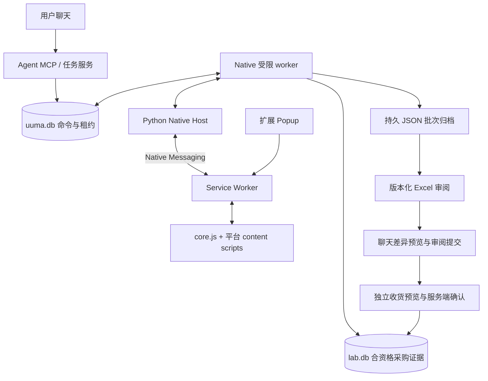

# 电商浏览器工作流与可行性计划

日期：2026-09-27（审阅修订）。状态：保留架构选择，技术契约已补充，用户已确认整行 self/others；尚未实现产品代码。原始核验日期：2026-09-25。

## 1. 本轮需求理解

用户希望 AI 使用自己已登录的指定 Chrome profile，主动完成网页上的搜索、打开、读取、翻页等重复操作，必要时才请用户协助。统一浏览器控制入口承载三条业务流程：

1. **已购订单 → 用途筛选 → 商品核对 → 实物验收 → 库存。** 待分类及未获实验室用途确认的商品不得入库；整行只选 self/others，不支持用途数量拆分。
2. **采购需求 → 网站搜索/采价 → 同规格比较 → 用户选择。** 采价是独立任务；保存当时所选 SKU、数量、价格条件、来源与时间。
3. **已选择方案 → 明确确认 → 加购 → 检查购物车。** 用户自行下单付款。加购不能隐藏在采价操作里。

优先使用网页操作，不依赖平台订单 API。当前先计划、记录证据与明确边界；这不代表用户已经确认某批商品属于实验室、某个加购方案或某次库存写入。

## 2. 实际核验结果

浏览器工具识别到 Chrome profile 显示名为 **Person 1**，连接类型为 **extension**，以及用户给出的三个现有标签页。该显示名不是 Chrome profile 的磁盘目录名，不能据此猜测配置路径。本次无需重新登录或导出 cookies。

| 平台 | 入口 | 本轮结果 | 尚未验证 |
| --- | --- | --- | --- |
| 拼多多 | `https://mobile.pinduoduo.com/orders.html` | 已识别现有标签页；尝试读取时被当前工具的站点安全策略阻止 | 页面读取、详情、翻页、商品采价、加购 |
| 淘宝 | `https://buyertrade.taobao.com/trade/itemlist/list_bought_items.htm` | 已识别现有标签页；尝试读取时被当前工具的站点安全策略阻止 | 页面读取、详情、导出订单按钮、翻页、采价、加购 |
| Shopee MY | `https://shopee.com.my/user/purchase/` | 已读取登录后的列表页、页面截图与 DOM 快照；当前快照含 5 个订单卡片、7 个商品条目 | 全部订单覆盖、订单详情字段、稳定订单行 ID、翻页/续跑、采价、加购 |

淘宝和拼多多的阻止来自本会话浏览器工具的站点安全策略；工具说明没有触发用户许可提示或自动审批。不能据此断言是网站反爬或平台不支持自动化，也不能声称读取已成功。不得换浏览器、原始协议、网络请求或自制扩展绕过该阻止；当前可继续使用用户主动提供的截图、导出文件或订单资料。连接层设计不构成绕过限制的理由。

用户给出的淘宝截图显示“导出订单”按钮，但未点击验证格式、范围或可用性。拼多多截图可以辨认商品、规格、数量、状态与实付标签；未取得可验证的订单号，不能仅靠这一张图建立稳定订单身份。

### Shopee 观察及修正

- 第一份可访问性树未返回商品名称、规格与数量；之后 DOM 快照取得了这些字段。因此应按实际字段完整性选择读取表示，而非把一次缺字段认定为整个页面不能读取。
- 电池样本的商品显示金额为 RM90.00，订单总额为 RM79.20。二者应分别保留；缺少详情时不能猜测差额属于哪种优惠或费用。
- 另一个条目包含连续的两个金额文本，表明只对整段文字抓一个数字可能混淆原价和成交价，需根据页面位置和语义解析。
- 一个订单卡片包含三个不同规格条目，数量分别为 1、1、2；不能把一个卡片当作一个商品行。
- 商品链接的可访问名称显示为“Go to PDP”，实际链接却指向订单详情；操作需检查真实页面目标，不能只相信标签名称。
- 上述条目只是结构验证样本，尚未认定用途、元件身份或实收状态，也没有写入库存。

## 3. 需要修正的认知

**统一浏览器入口可行，但每个平台仍需要自己的读取与操作规则。** 店铺、订单、SKU、运费和退款的展示结构不同。统一的是操作接口、数据格式和审阅流程。

**安装扩展只解决连接的一部分。** 完整系统还需要本地连接程序/MCP、任务流程、各平台页面适配、数据校验、去重、Excel 往返和库存服务。已选择厚扩展路线；既有连接证据仅作为可行性参考，不代表自建扩展已验收。

**浏览器操作不天然比正式 API 稳定。** 复用登录和操作真实页面符合本项目偏好，但网页改版、延迟加载、验证码、规格弹窗和账号切换都会影响结果。稳定性要靠每步核对、范围记录、断点恢复、错误停机及定期样本检查验证。

**看得见不等于能一次完整导出。** 未加载的订单、图片内文字、折叠费用和订单详情仍需额外读取。优先读取结构化页面文本；必要时用截图辅助，关键金额、规格和数量识别不确定时保留待核对。

**页面商品价不等于最终到手价。** 与账号、数量、优惠、运费和收货地点相关的条件要分别保存；不为了得到未知结算费用而隐式加购或提交订单。

**现有 LAB_BOT 后端已有 50+ MCP 工具。** 包括 `inventory_receive`、`inventory_preview_or_import_order_workbook`、`procurement_record_offers` 等。新增任务派发、恢复、批次提交及审阅接口，工具表见实施计划。现有 SourcingCrawlerEngine 保留至对应搜索能力通过验收；订单提取成功不代表旧搜索/1688 已替代。TaobaoParser 仅作搜索页面解析参考，不证明买家订单 DOM 可用。

## 4. 建议架构

浏览器控制只负责操作获准的目标页面；电商业务层负责解释字段、去重和校验；现有 LAB_BOT 保持库存写入责任。不要让网站文本或截图中的指令改变用户授权范围。

聊天和 Popup 使用同一持久任务协议；浏览器离线时显示 WAITING_FOR_BROWSER。原始批次先归档，lab.db 提交回执后再推进控制检查点；跨页面和重启按同一 batch_id 恢复。native worker 无库存写权限，MCP 身份不代替具体用户批准。完整接口、迁移和故障验收见 [实施计划](plans/labbot_implementation_plan.md)。

历史核验表明既有扩展可连接目标 profile 并读取少量 Shopee 列表；后续设计已选择自建扩展，其产品能力仍待独立验收。Microsoft 的 Playwright MCP 与 Chrome 扩展可作为通用架构参考，其文档描述了复用现有标签页和登录状态的能力；本轮未安装、未验证该框架，亦不将其作为访问已被阻止站点的替代通道。

AI 负责理解任务、处理差异和汇总；可重复步骤采用有前后条件检查的页面操作与解析规则。一个任务每次只控制一个目标标签页；用户切页、改规格或接管时暂停并重新核验状态，避免双方同时修改同一页。

## 5. 最小实现顺序与验收

### A. 连接与只读样本

确认 profile、平台账号和指定标签页；用户授权范围内读取少量列表及详情。当前从可访问的 Shopee 开始，其余两个平台保留用户提供资料的路径。

验收：来源和时间清楚；所有样本字段逐项核对；显示已读范围及缺字段；不改平台状态。当前只完成列表字段初步核验，详情与完整性仍待测。

### B. 订单记录及用途审阅

记录订单、订单行、来源快照、采集批次、整行 ownership 和审阅版本。保留稳定 ID 与用户修改，生成 Excel。重复提取只产生明确的状态或字段差异；不要重复建单。首次批量采集前确定时间范围或数量上限。

验收案例：一单多行、同商品不同 SKU、相同商品重复购买、整行 self/others 资格校验、拒绝用途数量拆分、排除后重导入、退款后再同步、旧版 Excel 回传冲突。冲突不静默覆盖新审阅结果。

阶段编号与实施计划统一：Phase 0 为连接与命令通道，1A 为 Shopee 持久采集，1B 为淘宝/PDD 独立验证或资料输入，1C 为用途审阅与收货。此处 A–E 是业务流程，不代表另一套交付编号。新四表 Excel 使用新增解析器；旧淘宝导入器不直接处理它。

### C. 收货集成

取得现有 LAB_BOT 工具及数据结构；对已确认整行 self、电子类且用于实验室的订单行，在元件、包装换算、实收数量、批次、状态与库位明确后生成收货预览。用户确认后写入事件；失败后查询事件状态再决定恢复方式。

验收：others、混合用途及待审阅行不入库；部分到货可分批验收并沿用整行 ownership，不构成用途拆分；同一确认重复调用只计一次；退款不会静默抹掉已收库存；实收超额必须单独核对。

### D. 采价与比较

用户确定需求和目的地后，逐站搜索或读取所给商品链接，选择符合要求的 SKU 和数量，记录原币价格及已知费用并生成 Excel。采价结果必须指向实际选定规格。

验收：标题相似但封装/规格不同不混比；整包、阶梯价、拼团等条件明确；未知费用不计零；报价失效可重采；清单能追溯来源。

### E. 加购

独立展示并确认账号、SKU、数量语义及价格范围，再读取购物车基线、执行加购并核对结果。不影响已有无关条目。

验收：购物车已存在相同 SKU、规格缺货、价格变化、点击后超时、网站未提供购物车、用户中途接管等情况均能报告准确状态；结果不明不自动重复点击；最终下单由用户完成。

## 6. 待补信息与默认安排

- **现有库存集成位置：** ~~需要 LAB_BOT 项目路径、工具定义和数据库结构才能实施库存对接；当前目录仅有需求文档。~~ ✅ 已查明：`lab.db` 位于 `%LOCALAPPDATA%\UuMA\forge-lab-bot\lab.db`，MCP 工具通过 `uuma.mcp_worker` 提供。详见 gap analysis。
- **提取范围：** 保持不变（当前只做少量样本验证，批量前明确日期或条数）。
- **用途规则：** 用户已确认整行 self/others、不支持用途数量拆分。AI 建议与用户确认分开，默认待审阅；未确认时不设置 ownership，不新增第三个枚举。
- **比价条件：** 保持不变（Phase 2 前确定）。
- **源码安排：** 扩展与 host 同放 UuMA，运行数据保持独立；本轮只改文档。

## 参考资料

- [Playwright MCP 官方说明](https://github.com/microsoft/playwright-mcp/blob/main/README.md)：通用浏览器控制与扩展连接模式。
- [Playwright Chrome 扩展说明](https://github.com/microsoft/playwright/blob/main/packages/extension/README.md)：现有标签页、登录会话与 profile 选择。
- [Chrome content scripts](https://developer.chrome.com/docs/extensions/develop/concepts/content-scripts)：读取页面 DOM 的能力。
- [Chrome Native Messaging](https://developer.chrome.com/docs/extensions/develop/concepts/native-messaging)：扩展与本机程序通信及来源校验。
