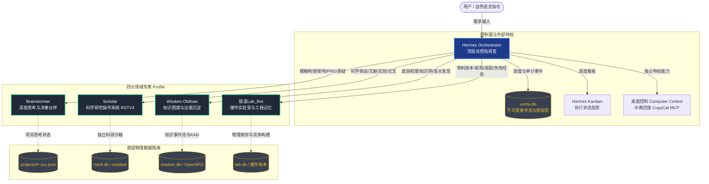
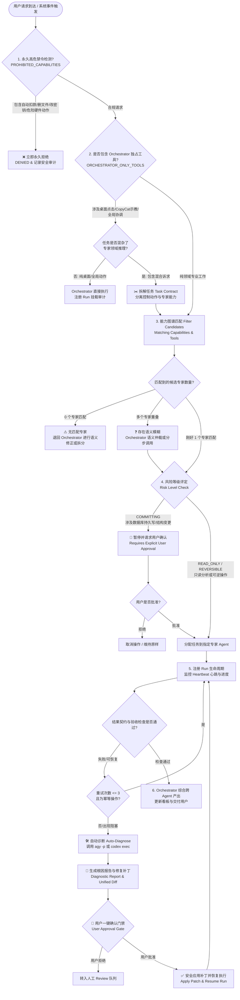
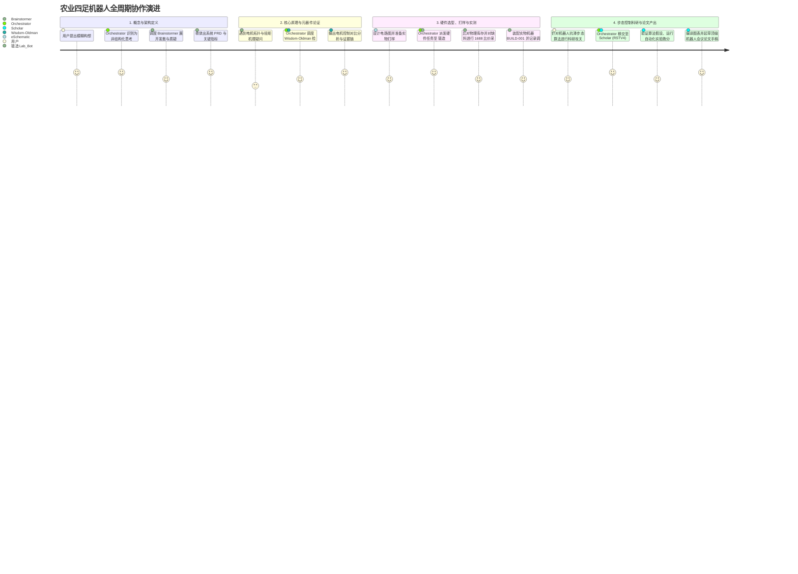

# UuMA Multi-Agent 系统工作流与逻辑图 (Logic Graphs & Workflows)

> **版本**：v1.0  
> **归属**：UuMA 控制面与 Hermes Multi-Agent 系统架构  
> **核心组件**：1 个顶层总控 (Hermes Orchestrator) + 4 个专业领域专家 (Brainstormer, Scholar, Wisdom-Oldman, 锻造Lab_Bot)。

---

## 一、 系统全景与数据主权拓扑 (System Map & Federated SoT)

UuMA 的多 Agent 体系建立在**“联邦数据主权 (Federated Source of Truth)”**与**“能力权限强隔离”**基础之上，各 Profile 各司其职，禁止越权操作与跨域状态污染。



### 核心数据主权矩阵 (Federated SoT Matrix)
| 领域与核心事实 | 唯一权威存储 (Source of Truth) | 协作准则 |
|---|---|---|
| **全局任务契约、路由决策、安全审计、计算机控制** | **Hermes Orchestrator (`uuma.db`)** | 专家 Agent 无权越权接管调度或篡改控制面记录 |
| **推演过程、未决假设、权衡决策依据、PRD/架构草案** | **Brainstormer (`projects/P-xxx/*.json`)** | 产出作为下游证据，不等于最终客观事实 |
| **科研假设、论文提纲、实验证据链、同行评审** | **Scholar (`rstv4.db`)** | 用户握有科研最终决定权（RSTV4是车，用户是司机） |
| **可复用世界/领域知识、5W1H机理、知识盲点** | **Wisdom-Oldman (`wisdom.db`)** | 独立于业务上下文，提供最新客观知识与证据网 |
| **物理库存流水、采购批次、真实组装构型 (As-Built)、工程经验** | **锻造Lab_Bot (`lab.db`)** | 物理硬件状态的唯一权威；电路设计权威归 eSchematic |

---

## 二、 Orchestrator 核心调度与决策逻辑图 (The Logic Graph)

Orchestrator 是整个系统的安全门禁与调度中枢。当一条请求到达时，依照以下确定性规则与语义判定树流转：



---

## 三、 各 Profile 核心工作流深度解析

### 1. Hermes Orchestrator (指挥中枢)
* **核心职责**：将模糊意图转化为严谨的 `TaskContract`，依据安全策略分发任务，并在最后综合多个专家的结果。
* **工作流**：
  $$\text{Task In} \longrightarrow \text{Policy Filter} \longrightarrow \text{Task Contract} \longrightarrow \text{Capability Route} \longrightarrow \text{Heartbeat Monitor} \longrightarrow \text{Result Verify} \longrightarrow \text{Deliver}$$

---

### 2. Brainstormer (深度思考与方案收敛)
* **核心职责**：把模糊的念头变成工程级可执行方案（PRD/架构图/SOP）。擅长在探索发散后进行严密质疑（Grill）并收敛。
* **技能集**：`discussion-state`、`discussion-reentry`、`discussion-checkpoint`、`artifact-readiness`。
* **思维管道 (Thinking Pipeline)**：
  ```text
  输入对话流 -> 意图解释器 (探索/质疑/对比/设计)
      -> 动态思考框架 (角色 Persona + 专业 Expertise + 视角 Lens + 技法 Technique)
      -> 深度质疑与盲点扫描 (Grill & Blind-Spot Scan)
      -> 成熟度推进: S0(未定义) -> S1(发散) -> S2(碰撞收敛) -> S3(明确定义) -> S4(可构建)
      -> 产出交付: 输出 PRD/架构方案，生成状态变更事务存入 projects/P-xxx.json
  ```

---

### 3. Scholar (科学研究操作系统 RSTV4)
* **核心职责**：陪伴科研人员走完科研全周期。“RSTV4 是车，用户是司机”，用户掌控核心学术主张、实验方案与发表决策。
* **五层科研组织拓扑 (Research Hierarchy)**：
  ```text
  Field (宏观研究领域)
    └── Project (科研项目) <──> Topic (可复用研究主题)
          └── Track (项目下属研究赛道/支线，拥有独立 Blueprint 蓝图)
                └── Manuscript (独立产出论文手稿，版本不可变，状态全审计)
  ```
  * **文献池隔离**：外部参考引文（`papers` / 文献池）与本团队产出的学术论文手稿（`manuscripts`）物理严格隔离。
  * **基石快照 (Research Foundation)**：支持将文献与证据打包为不可变的基石版本，各赛道显式绑定，升级需人机确认。
* **科研生命周期与蓝图流转**：
  ```mermaid
  stateDiagram-v2
      [*] --> Phase1_Literature: 1. 文献与痛点挖掘 (Gap -> Idea)
      Phase1_Literature --> Blueprint: 建立科研蓝图 (Research Blueprint)
      Blueprint --> Phase2_Experiment: 2. 实验与代码实现
      Phase2_Experiment --> Phase2_5_Viz: 2.5 实验图表可视化
      Phase2_5_Viz --> Phase3_Writing: 3. 论文手稿撰写与精炼
      Phase3_Writing --> Phase4_Publication: 4. 投稿评审与 Rebuttal 抗辩
      Phase4_Publication --> [*]

      Phase2_Experiment --> Blueprint: 实验证伪/调整假设 (Stale Propagation)
      Phase4_Publication --> Phase2_Experiment: 审稿意见要求补充实验
  ```
* **严苛信任与执行安全边界 (Trust & Safety Boundary)**：
  * **单次批准凭证 (Single-Use Approval Grant)**：只有用户向 Scholar 或总控显式输入 `APPROVE <proposal_id>` 时才生成一次性授权凭证，任何调用方伪造确认均被拒绝。
  * **无 Shell 参数化执行 (Shell-Free Argv Execution)**：实验仅在预批准计划内以向量参数运行，不经过 shell 解析，杜绝注入风险。
  * **脚本指纹防篡改 (Pinned Script Digest)**：对实验脚本做哈希校验，内容变动则计划自动失效。
  * **客观证据力分级**：文献“能否被检索到 (Resolvability)”与“内容在学术上是否支撑主张 (Scientific Support)”分别审计；同行评审仿真绝不捏造分数，统一标记为 `NEEDS_HUMAN_REVIEW`。
* **46 项 RSTV4 工具集成**：通过 `rstv4-worker` 导出包含 Track 管理、Foundation 绑定、实验执行、图表生成与 LaTeX 编译等 46 项原子化研究工具。

---

### 4. Wisdom-Oldman (第一性原理知识引擎与 KAG)
* **核心职责**：通过问题驱动闭环，探究事物背后的机理、依赖与边界，将零散信息加工为结构化知识，并主动指出未知盲点。
* **技能集**：`wisdom-investigate`、`wisdom-evidence-research`、`wisdom-knowledge-formation`、`wisdom-answer`、`wisdom-maintain-kag`。
* **知识闭环**：
  ```mermaid
  flowchart LR
      Q[核心问题] --> Probe[第一性原理探针<br/>5W1H/机理/SOTA/失效]
      Probe --> Gaps[发现有价值盲点<br/>Worthwhile Gaps]
      Gaps --> In[精准信息摄入<br/>文献/Datasheet/手册]
      In --> Form[上下文对齐与知识沉淀<br/>Entity/Claim/Evidence]
      Form --> KMap[(知识图谱 KAG<br/>wisdom.db)]
      KMap --> Out[双轨输出<br/>最优解答 + 剩余盲点]
      Out -. 伴随新盲点 .-> Q
  ```
* **双轨停止机制**：
  * **Answer Stop**：当前证据足够回答用户问题，立即响应，绝不拖延。
  * **Research Stop**：后台持续深挖，直到所有有价值盲点填平或用户叫停。

---

### 5. 锻造Lab_Bot (硬件实验室大管家)
* **核心职责**：连接“电路设计意图”与“物理世界硬件”。管理库存流水、物料采购、物理装配追溯、通电调试与故障经验。
* **硬件闭环交互时序**：
  ```mermaid
  sequenceDiagram
      autonumber
      participant Des as eSchematic (设计权威)
      participant Lab as 锻造Lab_Bot
      participant Crawl as 采购寻源 (爬虫/淘宝/1688)
      participant Real as 物理实验室 (实物装配/测试)
      
      Des->>Lab: 导出不可变设计清单 (Design BOM Rev-A)
      Lab->>Lab: 校验 lab.db 库存状态 (Available / Reserved)
      alt 发生缺料 (Shortage)
          Lab->>Crawl: 展开关键词寻源比价 (LCSC / 1688 / 淘宝)
          Crawl-->>Lab: 返回最优采购方案 (单店打包/最低到手价)
          Lab-->>User: 呈现比价决策链接 (人机确认后下单)
          User->>Lab: 到料验收入库 (inventory_receive -> Available)
      end
      Lab->>Real: 锁定物料并创建物理构建 (BUILD-001)
      Real->>Lab: 实装记录 (As-Built 构型: 记录飞线/代用件)
      Real->>Lab: 通电调试与工况记录 (Commissioning & Worklog)
      alt 发生硬件烧毁/故障
          Real->>Lab: 记录故障表象 (Failure Record)
          Lab->>Lab: 归因分析 (Observation != Hypothesis != Confirmed Cause)
          Lab->>Lab: 提炼候选经验 (CANDIDATE Lesson)
          Lab->>Des: 提出单向设计改进提案 (Design Feedback Proposal)
      end
  ```
* **核心铁律**：
  * `Designed BOM != As-Built BOM`（设计的电路图绝不等于实验室焊好的实物构型）。
  * `Observation != Hypothesis != Confirmed Cause`（看到的物理表象 $\ne$ 猜想 $\ne$ 确凿根因）。

---

## 四、 跨 Agent 典型场景实战全周期演进

以一个经典端到端工程为例：**“新型果园农业四足机器人全周期研发”**：



1. **构想阶段（Brainstormer）**：用户提出想法，Brainstormer 启动质疑并收敛出架构方案。
2. **机理阶段（Wisdom-Oldman）**：深入分析电机热耗散与 IP67 密封的物理矛盾，提供理论支撑。
3. **制造阶段（锻造Lab_Bot）**：盘点库存、比价采购缺料、建立 As-Built 真实装配构型、记录调试与故障经验。
4. **科研阶段（Scholar）**：根据实验数据提炼算法假说、跑分评测并编译 LaTeX 顶会论文。
