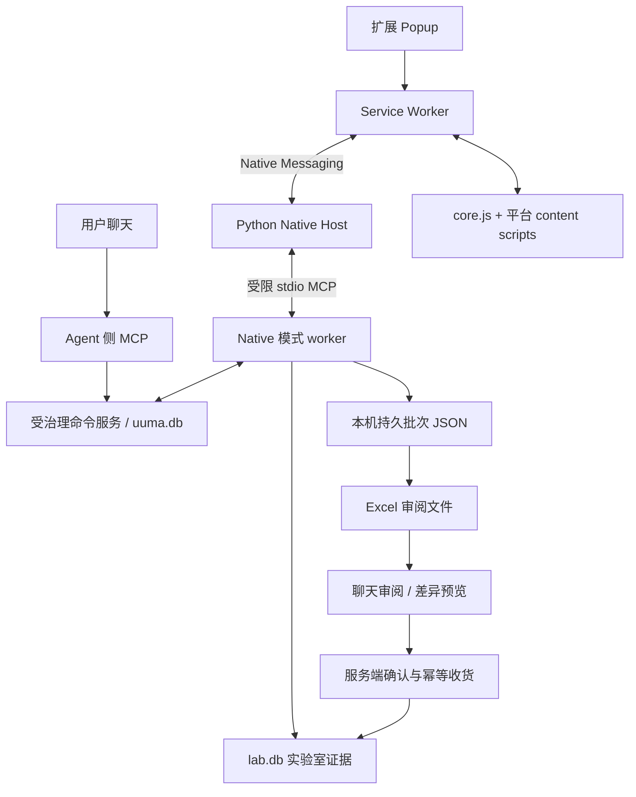

# Lab Bot 电商浏览器扩展实施计划

> **版本：** 0.5（2026-09-27，用户确认整行用途分类）
> **状态：** 技术缺口已纳入计划；用户已确认整行 self/others，不代表产品已实现或通过验收。
> **范围：** 本轮只修订设计文档，不安装扩展、不读取新订单、不执行库存或购物车操作。
> **关联文档：** [需求](../labbot_MCP_REQUIREMENTS.md)、[浏览器工作流](../labbot_BROWSER_WORKFLOW_PLAN.md)、[ADR 0001](../adr/0001-thick-chrome-extension-architecture.md)、[ADR 0002](../adr/0002-independent-mcp-worker-instance.md)、[术语](../../CONTEXT.md)。

## 1. 目标与保留的决策

使用用户现有 Chrome profile 和登录会话，通过自建 Manifest V3 厚扩展读取获准的电商页面。先交付 Shopee MY 订单提取，再交付审阅与收货；淘宝、拼多多分别验证，不将未测写成已支持。后续采价与加购独立交付。

保留：Native Messaging、本机 Python host、独立 stdio MCP worker、每平台一个适配器、JSON 归档与 Excel 审阅、电子类元件匹配、用户自行下单付款。扩展内负责 DOM 与逐页流程，本地服务负责授权、持久化、审阅和业务校验。

源码统一放在 UuMA，便于协议、迁移和测试共同版本管理：
- 扩展：`extension/labbot-browser/`。
- Host：`src/uuma/native_host/`，提供 `__main__.py`。
- 业务服务与 MCP：`src/uuma/`。
- 安装与管理：`scripts/`；运行数据仍在独立的本机数据目录。

数据库位置优先复用现有配置解析（包括 `LAB_DATABASE_PATH`、`UUMA_DATA_DIR`），默认 `%LOCALAPPDATA%\UuMA\forge-lab-bot\lab.db`。不得从另一个进程猜测数据路径。control 状态在 `uuma.db`，实验室业务在 `lab.db`，知识在 `wisdom.db`；不使用 Hermes `state.db`，不跨库 JOIN。

## 2. 本次审阅后的关键修正

| 原计划假设 | 修订后的实施要求 |
| --- | --- |
| 现有导入器可直接读取新 Excel | 新增版本化审阅格式解析；保留旧淘宝导入器兼容性 |
| 收货已有事件幂等键 | 新增确认键、唯一约束、原子写入及并发/超时重放测试 |
| 已见订单直接跳过 | 已见身份只防止重复建单；状态变化、缺字段和失败批次仍需同步 |
| worker 身份等于业务授权 | host 最小权限；写库存必须在服务端验证具体确认，不依赖 Hermes hook |
| MCP 工具记录结果就能控制浏览器 | 增加持久命令队列、领取租约和聊天到扩展的反向通道 |
| content script 内存足以续跑 | 跨导航检查点、持久批次回执、重启后核验与恢复 |
| 全部设计已批准 | 历史架构选择保留；本修订不冒称已获新业务规则批准 |

## 3. 已确认的用途模型

用户于 2026-09-27 选择简化模型：整行只选 `ownership=self / others`，不支持按用途拆分数量。此决定替代此前的实验室/个人/代购数量分配方案。

`ownership` 作用于整个稳定 `line_id`；不新增用途子行、实验室分配数量或比例字段。用户未确认时，ownership 保持未设置，独立的 review_status 表示待审阅，不增加第三个 ownership 枚举。混合用途行本期无法表示，保持待核对且不得部分划作 self 入库。

具体规则：
- 新行默认 `review_status=unreviewed`，AI 建议与用户确认分别保存。
- `category` 为 `electronics / consumable / tool / other`，不能凭电子类标签自动确认实验室用途。
- 仅用户已确认整行 `self` 且类别为 `electronics` 的行可进入收货预览；仍须明确确认该行用于实验室和具体实收记录，不能因 self 自动入库。
- `others` 整行排除收货；Excel、聊天和导入服务均拒绝用途数量拆分。部分到货/分批验收仍支持，但每次沿用同一行 ownership，并累计防止超收，不等同于用途拆分。
- 工具、耗材和其他非电子类本期不进入库存。
- 新采集的 `others` 行级明细不进入 `lab.db`；在本机 JSON 归档与 Excel 保留。订单级最小来源标识可以保留。
- 已写入采购证据的行后来被纠正为 `others`，追加排除修订、停止后续入库，不静默删除已有审阅或库存历史。既有历史不是重新采集代购明细的许可。

## 4. 架构与命令通道

### 4.1 聊天与 Popup 使用同一任务协议

1. Agent 调用 `browser_start_extraction`，提交用户指定的平台、账号本地标识、日期/订单范围及数量上限，产生持久 `task_id`。Popup 启动也走同一业务入口。
2. 控制服务在 `uuma.db` 保存命令和状态。host 通过受限 worker 在连接期间长轮询领取命令，再经 Native Messaging 发给 service worker。
3. 扩展仅在用户启用连接期间保持 host 在线。浏览器关闭、未安装或连接停用时，返回 `WAITING_FOR_BROWSER`，保留队列并说明需要打开 Chrome/启用连接，不宣称已开始提取。
4. service worker 将任务绑定到已核验的 profile 安装标识、平台账号和指定 tab；一个 tab 同时只运行一个任务。账号未知或切换必须暂停。
5. Agent 和 Popup 可查询、暂停、恢复、取消同一任务。取消使租约失效；迟到消息不得推进检查点。
6. 控制命令使用唯一 `command_id`，领取有租约与递增 fencing token。过期 host 的提交被拒绝；只读提取允许从最后持久检查点重新执行。

控制状态：`QUEUED → WAITING_FOR_BROWSER / RUNNING → PAUSED / FAILED / CANCELLED / COMPLETED`。
任务状态、原因、已完成范围、未完成范围、检查点和产物状态分别记录；`COMPLETED` 不代表用户已审阅或已收货。

### 4.2 原生连接与授权边界

- Native Host 验证 Chrome 传入的调用方 origin；manifest 的 `allowed_origins` 固定到扩展 ID。
- worker 新增 native 客户端模式：只暴露任务领取、状态、批次提交及恢复查询等窄接口；不暴露通用工具转发、SQL、任意路径读写或 `inventory_receive`。
- `UUMA_AGENT_ID=forge-lab-bot` 只表示进程身份，不代表用户已确认某项业务操作。所有客户端入口最终调用同一服务端校验。
- service worker 校验实际 sender 的扩展身份、tab、frame、URL 与任务绑定；不相信 payload 自报的 tab/account。
- 消息带 `protocol_version, request_id, task_id, command_id, lease_token, batch_id` 及 payload；明确超时、错误类型、取消与重放语义。
- 禁止网页文字触发新的命令或扩大范围。第一阶段仅提供只读页面动作，不能点击付款、退款、平台确认收货或加购。
- 不读取/输出 cookies、密码、令牌。日志只保留必要的任务标识和错误，不记录完整敏感页面。
- 不绕过当前工具或平台的访问限制。淘宝/PDD 的历史阻止来自工具策略，不等于已证明网站反爬；未获得允许的验证路径时使用用户提供资料。

## 5. 持久化、身份与同步

### 5.1 存储职责

| 存储 | 记录 |
| --- | --- |
| `uuma.db` | 浏览器任务、命令、租约、取消、范围、检查点、业务授权引用；不保存商品行明细 |
| 本机 commerce 归档目录 | 原始结构化批次、来源指纹、审阅修订和 Excel；包含未分类/非实验室行，不含凭据 |
| `lab.db` | 订单级最小来源、符合用途规则的采购证据、元件引用、收货确认与库存事件 |

归档目录位于已解析的实验室数据目录下的 `commerce/`。按任务和不可变批次 ID 命名，不允许消息指定任意输出路径。输出生成失败可从持久批次再生成，不能迫使用户重新爬取。

### 5.2 身份与冲突

- 订单作用域：`(platform, account_id, order_id)`；account_id 为稳定本地映射，不使用会变化的显示名作主键。
- 有可靠平台行 ID 时优先采用。否则以 `product_id + normalized_sku_hash` 作候选关联键，分配独立稳定 `line_id`。
- SKU 规范化需版本号，保留原文；不靠行号、Excel 排序位置或文件 hash 定义业务身份。
- 同订单相同商品相同规格的多行不得合并或覆盖。缺少稳定 ID 或候选键碰撞时保留两条来源，标记 `pending_identity_review`，不得入库。
- 同一业务行的采集版本、用户审阅版本分开。退款/取消/数量变化生成证据修订与待核对差异，不覆盖人工结论。

### 5.3 批次持久提交和故障恢复

每个批次的 `batch_id` 固定，另保存 payload hash。相同 ID/相同 hash 重放返回同一回执；相同 ID/不同 hash 拒绝。

提交顺序：
1. 校验任务范围、租约、来源与字段；原始批次先写临时文件、刷盘并原子重命名为不可变归档。
2. 在 `lab.db` 一个短事务内写批次回执、订单证据及允许的采购行，唯一约束阻止并发重复。
3. 再通过控制服务推进检查点；成功后才给扩展 durable ACK。
4. 文件已落盘但 DB 未提交时重放同批次；DB 已提交但控制更新/ACK 丢失时查询回执并补齐。不得声称跨文件与双数据库存在原子事务。
5. 只有批次和最终产物都持久化且范围完成，才能标记 extraction `COMPLETED`。文件丢失/磁盘满时保留失败原因并停止推进。

建议新增实验室表：`commerce_batches`（批次 ID/hash/归档引用/回执）、
`order_headers`（账号作用域、首次/最近观察、最新证据版本、完整性）、
采购证据修订与 review 映射、`receipt_confirmations`。
先核对现有 schema 后编写版本迁移，不直接复制原计划的单一 `fully_processed` 表。

原 `purchase_history_lines.source_key` 保留兼容；新浏览器行通过独立稳定 `line_id` 映射。旧行无法可靠关联时保持待核对，不凭文件顺序批量回填。

### 5.4 去重不是永久跳过

移除“查询所有 order_id 后过滤”的算法，也不让 host 直接读取业务表。通过 MCP 的语义状态接口查询该任务需要补齐的记录。

授权范围内再次观察订单列表；未完成订单、非终态订单以及字段/状态指纹变化的订单重新读取必要详情。用户明确请求刷新时也重新读取。终态缓存仅在已验证完整且无变化时复用；列表未展示的退款字段仍需按任务刷新策略核查详情。不得越过用户授权日期/数量范围自动扩大采集。

## 6. 厚扩展生命周期

`core.js` 与平台适配器负责 DOM 解析；service worker 协调跨页面状态。content script 被页面导航销毁是正常路径，不能靠其内存保存唯一进度。

适配器契约应包含：
- 识别账号、列表/详情页面，验证 URL 与页面结构；
- 读取订单卡片、稳定身份、规格、数量和金额语义；
- 列出仍需补齐的详情字段及实际详情链接；
- 下一页/懒加载完成判断、循环检测、空页与缺字段区分；
- 登录失效、验证码、结构变化、用户接管的明确检测。

导航前保存 `list_url, detail_queue, active_order, resume_action, page_cursor, acknowledged_batch_ids`。
新 content script 启动后向 service worker 报到，只接收当前有效任务的恢复指令。再验证账号、页面与待办步骤后继续；tab ID 在重启后不能直接复用。

暂态只读错误最多重试三次并退避。验证码、登录失效、页面变化、账号切换、用户操作或结构不确定时立即暂停；保留已完成/未完成范围。关闭 Popup 不取消任务；显式停止才取消或暂停。恢复须核验范围和登录身份。

Native Messaging 用长度前缀 JSON；host→Chrome 单消息上限 1 MiB，应用层按编码后的字节数分块并限制未确认批次数。不要一次发送无界的历史订单 ID 列表。
`connectNative` 可以维持连接期间的 worker 生命周期，但不替代持久恢复。使用固定版本 MCP SDK 处理初始化、initialized 通知、请求关联与子进程清理，stdout 只输出协议数据。

## 7. Excel 审阅协议

### 7.1 四张工作表

1. **说明与摘要**：schema_version、workbook_id、export_id、生成时间、任务范围、来源摘要、未解决项。
2. **订单待核对**：稳定 line_id、base_evidence_version、base_review_version、原始字段、AI 建议、用户可编辑字段。
3. **比价清单**：Phase 2 前明确显示“尚未启用”，不伪造报价。
4. **收货确认**：Phase 1C 前不执行；之后展示预计、累计已收、此次实收/不良、批次、库位与确认预览。

使用 openpyxl，保留数据验证、条件格式和命名范围。订单号/SKU/长 ID 按文本写入；外部标题等按普通字符串写入，不能成为公式。公式、隐藏列和工作表保护都不是服务端授权依据。

### 7.2 新旧格式分开处理

现有 `inventory_preview_or_import_order_workbook` 只支持已有淘宝导出格式，继续保留。
新增 `commerce_preview_review_workbook` 和 `commerce_commit_review`，不将四表工作簿伪装成旧淘宝文件。

新解析器依据 metadata 识别版本，拒绝不支持的版本、伪造/重复 line_id、篡改原始字段、非法分类及数量。日期、币种、单位、缺失值与精度必须有明确规则；金额未知不得转为零。

导入流程：
1. 解析后按 line_id 对照可信导出基线，只允许修改声明的审阅列；行排序不影响身份，删除行不等于删除订单。
2. 比较 base_evidence_version 与 base_review_version。旧工作簿只报告冲突，不静默覆盖新审阅或新退款证据。
3. 生成差异预览，返回 preview_id、payload hash、冲突和拟提交记录。聊天单行修改也调用同一服务。
4. 用户确认此差异后提交；提交时重新检查版本。相同提交键同 payload 返回原回执，不同 payload 拒绝。
5. 审阅提交只更新采购审阅，不产生库存事件。Excel “确认”单元格本身不构成收货授权。

归档修订先持久化，以唯一 review_commit_id 幂等投影到 `lab.db`；崩溃后恢复同一投影。未完成投影保持可见状态，不返回已全部提交。

## 8. 收货与审批契约

本期必须扩展现有收货能力；当前 `inventory_receive` 尚无本计划要求的幂等确认键。

新增收货预览：要求已确认用途、电子类、eSchematic 标准元件、包装换算依据、合格实收数量、批次与库位。平台“交易完成/已签收”和商品匹配成功都不能替代用户实物验收。

- 每购买单位含多少库存基础单位必须明确；套装拆项单独列出。
- 同一行允许分批收货；此次合格数量加累计已收不得超过已确认可收数量，超额必须重新核对。
- 不良数量不能进入 AVAILABLE；不明数量、退款差异或身份冲突阻塞预览。
- 预览包含 order line、revision、component、数量/单位、批次、库位及 payload hash。
- 由受信任的用户确认入口签发绑定到该预览的 approval_ref；agent/网页不能自行设置 approved=true。确认需有会话来源、过期/撤销规则，字段变更后重新预览。
- 审批控制记录在 `uuma.db`；服务先将批准绑定到唯一 confirmation_id，再在 `lab.db` 事务中写确认记录和库存事件。崩溃后只允许相同 confirmation_id/hash 重放并补齐完成状态；不另发一个确认键。
- `receipt_confirmations.confirmation_id` 唯一；同键同 payload 返回原 event_id，同键不同 payload 拒绝。并发提交也只产生一次 RECEIVE。
- 提供按 confirmation_id 查询结果的接口。超时先查询或同键重放，不生成新事件。
- 兼容旧调用方时逐一迁移；不得保留绕过新审批/幂等验证的备用写入口。native 模式始终无收货权限。
- 已收后退款或用途纠正只追加差异；如需库存修正，用明确批准的补偿事件，不改写旧流水。

## 9. MCP 工具与实现工作包

下列为拟新增接口，尚未实现；最终参数用同一版本化 schema 定义。

| 工具组 | 主要接口 | 边界 |
| --- | --- | --- |
| Agent/Popup 任务控制 | browser_start_extraction、browser_get_extraction_status、browser_pause_extraction、browser_resume_extraction、browser_cancel_extraction | 创建/管理授权范围内任务；不代表已开始浏览 |
| Native 任务执行 | browser_claim_command、browser_renew_lease、browser_extract_orders、browser_report_checkpoint | 验证当前任务/租约；提交批次与范围 |
| 审阅 | commerce_preview_review_workbook、commerce_commit_review | 预览/提交审阅修订；不收货 |
| 收货 | inventory_preview_receipt、受治理 inventory_receive、inventory_get_receipt | 用户确认、幂等写入、查询 |
| Phase 2 | browser_search_products、browser_snapshot_offer | 前者派发只读搜索任务，后者提交有来源的报价；结果记录不冒充浏览动作 |
| Phase 3 | browser_preview_cart_operation、browser_add_to_cart、browser_check_cart | 预览、批准后派发、实际状态核验；不付款 |

代码工作包：
- 任务服务、受限 worker 模式、授权验证及 schema；
- 归档/批次存储、订单版本与迁移；
- 原生 host、固定 ID 扩展、安装/卸载与状态诊断；
- core/service worker 及逐平台适配器；
- 新 Excel 导出/解析、差异与冲突服务；
- 幂等收货和旧入口迁移；
- 对应契约测试与现场验收记录。

## 10. 阶段与验收

### Phase 0：连接、命令通道与边界

交付扩展骨架、固定 ID、host 注册、受限 worker、持久任务通道。安装路径由安装器生成，不在源码硬编码用户目录。Windows launcher、正确工作目录、Python 路径和 `__main__` 现场验证。

验收：Popup 与聊天均能发起同一类任务；关闭浏览器显示 WAITING_FOR_BROWSER；错误 origin、越权工具、伪造 tab/account、过期租约被拒绝；暂停/取消有效；子进程正常回收。记录连接与往返耗时，不用固定 500ms 把机器冷启动误判为协议失败。

### Phase 1A：Shopee 只读采集及持久恢复

交付列表/必要详情、分页、范围上限、批次落盘、身份/版本模型和 Excel 初稿。只读平台，不入库。

验收至少覆盖：
- 5 个实际获准订单样本，含一单多行、SKU 差异、缺字段与订单总额不等于商品价；
- 列表→详情→返回、分页/懒加载、用户接管、账号切换；
- 写文件前、写文件后、DB 提交后、ACK 前分别中断并恢复；
- 重复/乱序批次、同 ID 不同 payload、双 host 并发；
- 退款/取消变化、已知但不完整订单再同步；
- 磁盘满、归档缺失、Excel 生成失败后重生成；
- 完成范围可信，未知总页数不编造。

### Phase 1B：淘宝/PDD 独立验证与资料导入

每平台先验证获准页面、稳定订单身份、列表/详情与分页，再实现适配器。旧 TaobaoParser 仅作商品搜索解析参考，不能证明买家订单 DOM 可用；截图也不能替代 selector/身份验证。

每个可用平台至少 3 个订单样本并通过恢复测试；不可用标记 BLOCKED/DEFERRED，不算测试通过。淘宝现有导入器只在文件符合旧格式时使用；PDD 文件/截图需独立解析与人工核对，不声称淘宝导入器通用。

### Phase 1C：用途审阅与电子类收货

按已确认的整行 self/others 冻结字段，交付新 Excel 往返、聊天修订、包装换算、元件核验、部分收货及服务端确认。

验收：排序/修改后 ID 不变；重复导入无重复行；旧版本冲突；非法字段及用途数量拆分被拒绝；整行 self/others 修改可追溯；混合用途行保持待核对；AI 建议不自动变确认；非电子类/非合资格用途不入库；部分到货和不良数量正确；同确认并发/超时重放只有一条收货；退款和用途纠正不改写历史；未经确认或过期批准的写入被拒绝。

### Phase 2：采价与比较

交付真实搜索命令、报价快照、MYR 总到手价和比价表。实施前确定目的地与比较条件。币种、汇率时间、包装/阶梯价、运费/税费来源可追溯；未知费用不计零，规格不同不混比。旧 crawler 的 1688 范围尚无替代，保持明确不支持或另行规划。

### Phase 3：购物车

先核验账号、SKU、数量语义、价格上限和购物车基线，再展示预览取得具体确认。操作 command_id 唯一；点击后超时标记 UNCERTAIN，先查实际数量，不盲目重试。不得修改无关条目；只提供立即购买的平台路径不执行。

## 11. 迁移、部署与回退

- 实施前备份现有 DB，新增版本化迁移；旧淘宝采购记录和库存事件全部保留。
- 新表/index 的唯一约束与旧数据冲突必须报告，不自动删数据。
- 显式配置并验证 SQLite busy timeout、短事务及所选 journal mode；不能因采用 SQLite 就假定现库已开启 WAL。
- 部署时验证所有进程解析到同一预期数据目录。安装器仅注册本用户 native host，保存被替换配置；固定扩展 key/ID 不随机变化。
- 保留旧 crawler 实现。只有对应的新能力通过验收才切换路由并标记弃用；订单提取成功不代表旧搜索/1688 功能已替代。
- 回退先停止新任务并使租约失效，再恢复原路由/注册配置；不删除新采购证据、归档、审阅或收货事件，不降级破坏 schema。
- 每阶段记录自动测试、实际样本、未测项与阻塞原因；遵循仓库阶段 gate，本文不自行修改 mission_status.json。

## 12. 参考与当前边界

[Chrome Native Messaging](https://developer.chrome.com/docs/extensions/develop/concepts/native-messaging) 规定 origin、消息格式与 host→Chrome 1 MiB 上限；
[content scripts](https://developer.chrome.com/docs/extensions/develop/concepts/content-scripts) 和
[service worker 生命周期](https://developer.chrome.com/docs/extensions/develop/concepts/service-workers/lifecycle) 为连接实现依据，Phase 0 按实际 Chrome 版本核验。

截至本修订：沿用既有架构选择，修复原文乱码与失效假设，未运行新的浏览器现场验收；用户已明确确认整行 self/others、不支持用途数量拆分；不再有该产品规则待答复项。
